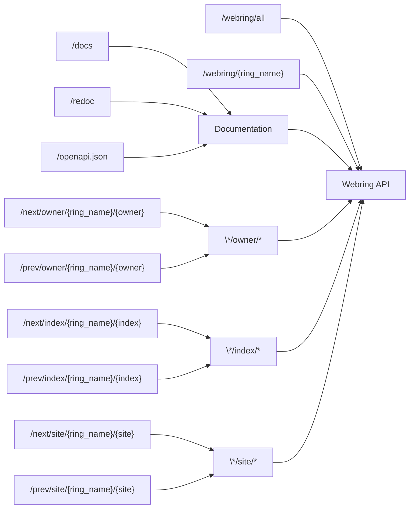
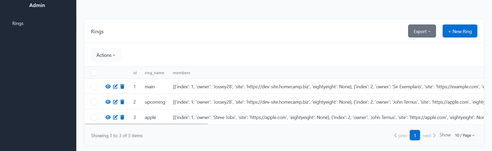
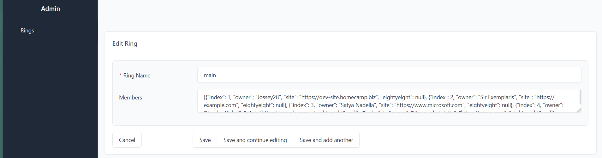

# Webring API

## Objective

[Webrings](https://en.wikipedia.org/wiki/Webring) are super cool, and since my friends have started creating their own personal websites, I thought it'd be fitting to creating a tool to help us a webring mangement tool. 

As projects do, it got scope creeped and ended up evolving into a centralized webring creator and mangement tool with an admin dashboard. 


#### Hackclub Mandatory AI-Usage

*AI was used during the creation of the web application. AI usage is primarily limited to debugging of Javascript in the example websites and issues I faced while setting up Docker. AI was used during the creation of the primary API web application, however usage was as minimal as I could make it with respect to time*

## How it Works

### The Techstack

| Technology      | Purpose                                                                                                         |
|-----------------|-----------------------------------------------------------------------------------------------------------------|
| FastAPI         | This is my python framework of choice, it defines all the API endpoints and their functionality                 |
| Pydantic        | I have an obsession with type safety and its enforcement, pydantic is here to help with that.                   |
| SQLModel        | It allows me to programmatically define my database model while ensuring strict type safety during compile-time |
| HTML + CSS + JS | These three tools are what compromise my basic example sites                                                    |

### Defined Types

*Memeber*
```json
{
   "properties":{
      "index":{
         "title":"Index",
         "type":"integer"
      },
      "owner":{
         "title":"Owner",
         "type":"string"
      },
      "site":{
         "title":"Site",
         "type":"string"
      },
      "eightyeight":{
         "anyOf":[
            {
               "type":"string"
            },
            {
               "type":"null"
            }
         ],
         "default":"None",
         "title":"Eightyeight"
      }
   },
   "required":[
      "index",
      "owner",
      "site"
   ],
   "title":"Member",
   "type":"object"
}
```

*Ring*
```json
{
   "properties":{
      "id":{
         "anyOf":[
            {
               "type":"integer"
            },
            {
               "type":"null"
            }
         ],
         "default":"None",
         "title":"Id"
      },
      "api_keys":{
         "anyOf":[
            {
               "items":{
                  "type":"string"
               },
               "type":"array"
            },
            {
               "type":"null"
            }
         ],
         "default":"None",
         "title":"Api Keys"
      },
      "ring_name":{
         "title":"Ring Name",
         "type":"string"
      },
      "members":{
         "items":{
            "additionalProperties":true,
            "type":"object"
         },
         "title":"Members",
         "type":"array"
      }
   },
   "required":[
      "ring_name"
   ],
   "title":"Ring",
   "type":"object"
}
```

### The API endpoints


*no real need to use this block, It just looks cool.*


```
/ --> Returns a link to the default webring

/admin --> Allows you to access the admin dashboard

/docs --> Good 'ol Swagger docs
/redoc --> ReDoc, for those who don't like Swagger's UI
/openapi.json --> The JSON if you want to show it elsewhere

/webring/all --> Returns the memebers in the default webring
/webring/{ring_name} --> Returns the memebers in the specified ring

/next/owner/{ring_name}/{owner} --> Returns the next member given the requests "owner" path parameter
/prev/owner/{ring_name}/{owner} --> Returns the next member given the requests "owner" path parameter

/next/index/{ring_name}/{index} --> Returns the next member given the requests "index" path parameter
/prev/index/{ring_name}/{index} --> Returns the next member given the requests "index" path parameter

/next/site/{ring_name}/{site} --> Returns the next member given the requests "site" path parameter
/prev/site/{ring_name}/{site} --> Returns the next member given the requests "site" path parameter
```

### Admin Management


*the primary page that shows when you access the admin endpoint*


*the page that shows when you attempt to modify a ring*

## Possible Improvements

The current admin ui doesn't have proper JSON validation on save when modifying ring members. I could look into creating a custom admin dashboard.